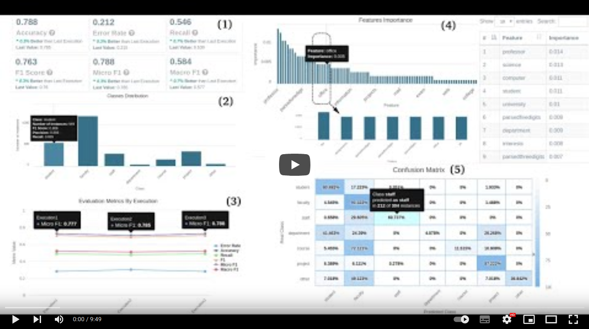

# Explain-ML

Explain-ML is a web based  application, developed using the  Python Web framework Django[^1], using Sqlite[^2]. The screenshots and visualizations presented in this section are related to a version of Explain-ML, instantiated with Random Forests (as ML model) applied to automatic text classification (ATC) (as ML task). The instantiated version employs the Scikit-Learn[^3] implementation of the  Random Forests Model. The initial design of ExplainML focused on demonstrating our hypotheses that a multi-view and multi-perspective visualization  approach for interpreting results could aid users to better interpret the results of a ML model.

The design process adopted to develop Explain-ML was a user-centric design, which allowed us to consider users' views and perspectives on what aspects would be relevant in an ML explainability tool. Thus, our design process included (i) Persona and Scenarios definition to guide the design process, (ii) interviews with users to better define our requirements, (iii) development of a prototype to represent our requirements-based solution and a (iv) evaluation of this prototype to better guide the (v) tool development.

Explain-ML is based on the work presented in [this paper](https://arxiv.org/abs/1602.04938) ([bibtex here for citation](citation.bib))

Although there is a functional version of Explain-ML, it is not yet available to the general public because it  is still in development and is a research prototype, with still much to be improved and new investigations to be performed. Furthermore, making it available would require creating a solution to store and maintain users’ data which is a challenge for creating a product, but not for the research being conducted.

In any case, we have made available this GitHub project containing more information about the project and the tool, including a video demo of the system. We intend to include in the near future an interactive demo, that will allow users to interact and test the system with the database used in the evaluation but not with new data. 

Here is a link to the video demo:

[^1]: https://www.djangoproject.com/
[^2]: https://www.sqlite.org/index.html
[^3]: https://scikit-learn.org/stable/
